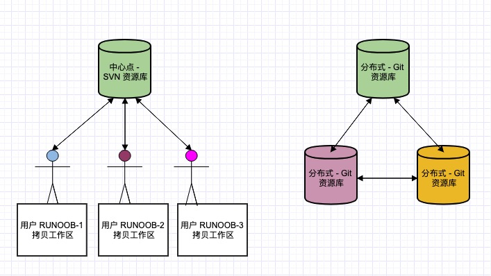

### Git 特点： 与SVN区别


### Git 工作区、暂存区和版本库


### 设置用户信息
```sh
git config --global user.name 'heifade'
git config --global user.email 'heifade@126.com'
```

### 基本命令
```sh

git add . # 将文件放入 index
git commit -m '提交说明' # 将 index 里的文件提交到版本库
git push # 推送到服务端
```

```sh
git commit -am '提交说明' # 等价于下面2条命令
# 1. git add .   
# 2. git commit -m '提交说明'
```

### 分支
```sh
git branch # 列出所有分支(本地)
git branch -a # 列出所有分支(服务端+本地)
git branch <NAME> # 创建名称为 NAME 的分支
git branch -d <NAME> # 删除本地分支 NAME
git push origin --delete <NAME> # 删除远程分支 NAME
```

### 检出分支
```sh
git checkout <NAME>
```

### 合并分支
```sh
git merge <NAME> # 将 NAME 分支合并到此前分支
```


### 查看提交历史
```sh
git log # 列出所有提交
git log --oneline # 将 id 分支名 提交说明放到同一行里显示
git log --graph # 显示提交拓扑图
git log --reverse # 倒序显示
git log --author=<USER> # 只显示某人提交的
git log -3 # 只显示3条提交
```

### 标签
```sh
git tag # 显示所有标签(以标签的字母顺序，不是以提交的顺序)
git tag -a <TAGNAME> -m '说明' # 添加 名为 TAGNAME 的标签
git tag -a <TAGNAME> -m '说明' <65aed7a> # 给 65aed7a 追加 tag
git tag -l 'v1.*' # 列出以 "v1." 开头的标签

git tag -d <TAGNAME> # 删除本地 TAGNAME 的标签
git push origin :refs/tags/<TAGNAME> # 删除服务器的上 TAGNAME 标签

git push origin --tags # 向服务端推送所有 tag

git checkout v1.0 # 检出 标签为 v1.0的提交
```

### 远程
```sh
git remote -v # 显示所有远程的简称与URL
```

### 别名
```sh
git config --global alias.g 'log --oneline --graph' # 以后就可以用 git g 来替代 git log --oneline --graph
```