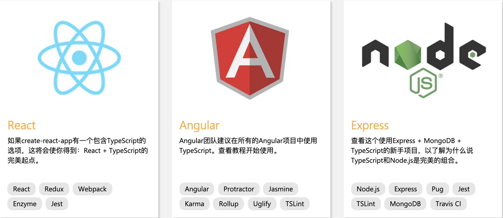
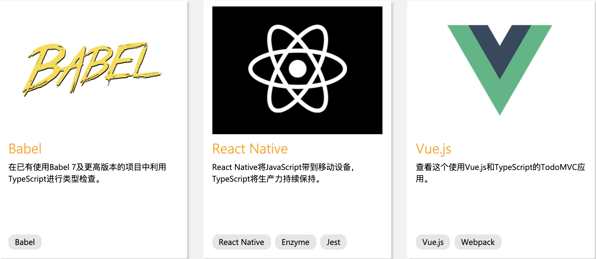
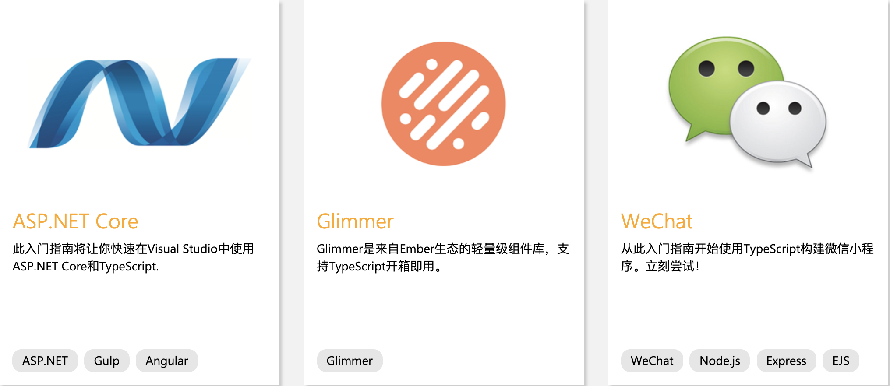
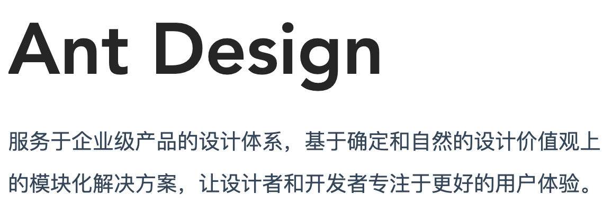

## TypeScript

### [参考资料](https://www.tslang.cn/docs/home.html)

### 前言

TypeScript(以下简称 TS)是一种由微软开发的自由和开源的编程语言。它是 JS 的一个超集。 C#的首席架构师 Anders Hejlsberg，已工作于 TS 的开发。
TS 扩展了 JS 的语法，所以任何现有的 JS 程序可以不加改变的在 TS 下工作。TS 是为大型应用之开发而设计，而编译时它产生 JS 以确保兼容性。
Google 公司与微软合作，用 TS 写了 Angular2

### TS 支持情况






### 1. TS 的安装

1. 安装 tyarn 
```cmd
npm i yarn tyarn -g
```

2. 使用 tyarn
```cmd
tyarn add typescript
```

3. 安装 typescript

```cmd
tyarn add global typescript
```

4. 安装 ts-node

```cmd
tyarn add global ts-node
```

### 2. [编译 demo-tsc](./demo/demo-tsc/README.md)

### 3. [调试 demo-debug](./demo/demo-debug/README.md)

### 4. [运行 demo-run](./demo/demo-run/README.md)

### 5. [配置文件 demo-tsconfig](./demo/demo-tsconfig/README.md)

### 6. [TypeScript 语法](./README_TS.md)

### 7. [TypeScript 项目](./demo/demo-project/README.md)

### 8. [TypeScript 项目 发布到 npm](./demo/demo-project-sum/README.md)

### 9. [打包工具 webpack](./demo/demo-webpack/README.md)

### 10. [打包工具 rollup](./demo/demo-rollup/README.md)