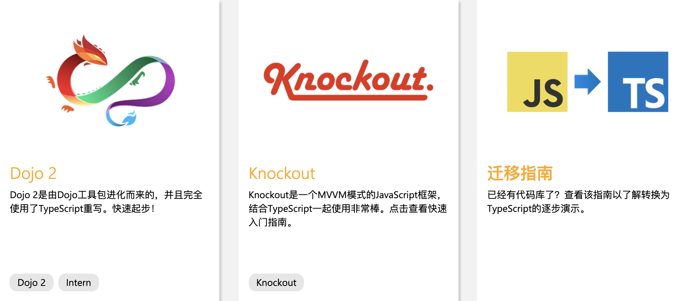

## TypeScript

### [参考资料](https://www.tslang.cn/docs/home.html)

### 前言

TypeScript(以下简称 TS)是一种由微软开发的自由和开源的编程语言。它是 JS 的一个超集。 C#的首席架构师 Anders Hejlsberg，已工作于 TS 的开发。
TS 扩展了 JS 的语法，所以任何现有的 JS 程序可以不加改变的在 TS 下工作。TS 是为大型应用之开发而设计，而编译时它产生 JS 以确保兼容性。
Google 公司与微软合作，用 TS 写了 Angular2

### TS 支持请况





### TS 的安装

```cmd
npm i typescript -g
```

### 编译

```cmd
tsc index.ts  # 编译 index.ts 成 index.js
tsc *.ts  # 编译 当前目录下的所有.ts 文件 成 .js
tsc # 根据 tsconfig.json 配置来编译
```

### [配置文件 tsconfig.json](./demo/demo-tsconfig.json/README.md)

如果一个目录存在 tsconfig.json，这个目录就是 TS 项目的根目录

- 命令 tsc 且参数为 \*.ts，编译此.ts 文件成 .js
- 不带任何输入文件的情况下调用 tsc，编译器会在当前目录查找 tsconfig.json 文件，如果当前目录没有，逐级向上搜索。
- 不带任何输入文件的情况下调用 tsc，且参数 --project 或 -p 指定一个包含 tsconfig.json 文件的目录

### 特性

- 强类型
- 类型批注和编译时类型检查
- 类
- 泛型
- 接口
- 模块

### [基础类型](./demo/demo-basetype/README.md)

### [变量声明](./demo/demo-declare/README.md)

### [方法](./demo/demo-function/README.md)

### [接口](./demo/demo-interface/README.md)

### [类](./demo/demo-class/README.md)

### [泛型](./demo/demo-generic/README.md)

### [类型推论](./demo/demo-inference/README.md)

### [类型兼容性](./demo/demo-compatibility/README.md)

### [高级类型](./demo/demo-senior/README.md)

### [模块](./demo/demo-module/README.md)

## [命名空间](./demo/demo-namespace/README.md)